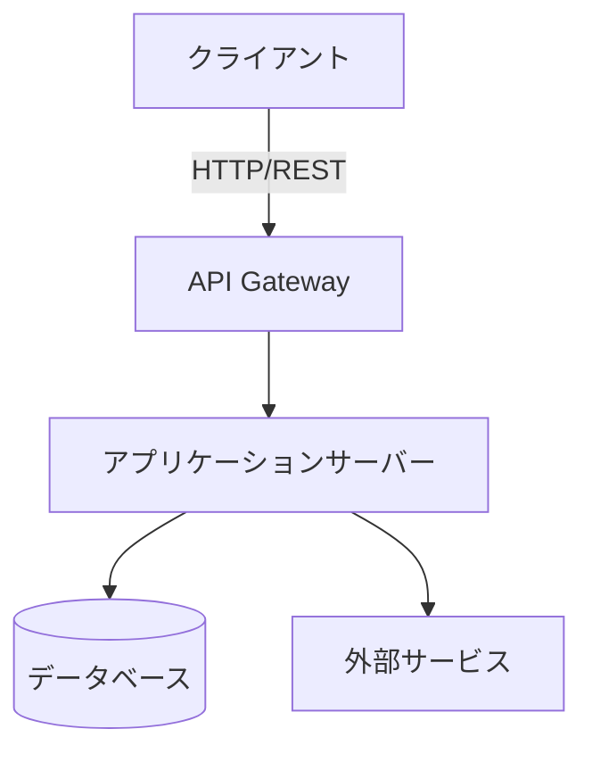
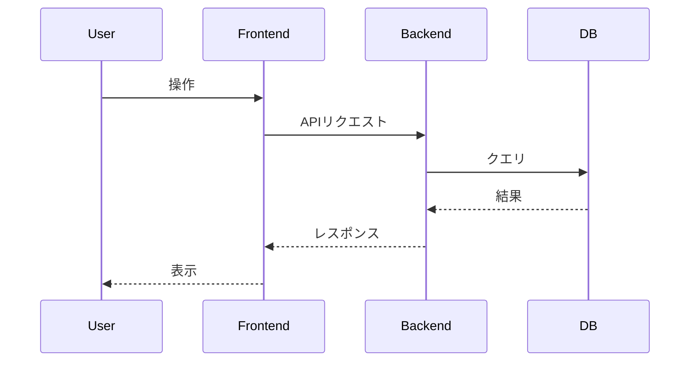

<!-- このファイルは docs/design-doc.md の一部です -->

# 設計概要: アーキテクチャ・データフロー

## 4. 設計概要

<!-- システム全体の構造を俯瞰できる図・フローを記載する。
     詳細に入る前に「何をどう組み合わせるか」の全体像を示す。 -->

### アーキテクチャ図

### データフロー

### 主要コンポーネント

| コンポーネント  | 役割     | 技術         |
| --------------- | -------- | ------------ |
| コンポーネントA | （役割） | （使用技術） |
| コンポーネントB | （役割） | （使用技術） |
